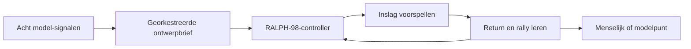

# ◈ MODEL ARENA // 3D PONG

<p align="center">
  <strong>EEN KLEINE BAAN. ACHT SIGNALEN. ÉÉN ADAPTIEVE TEGENSTANDER.</strong><br />
  <em>Menselijke reflexen tegen RALPH-98 — een lokale Three.js-game, gebouwd met het Kathedraal-modelensemble.</em>
</p>

<p align="center">
  <a href="https://3d-pong-model-arena.vercel.app"></a>
  
  
  
</p>

> **[Open de live game](https://3d-pong-model-arena.vercel.app)** — de productie-alias is gecontroleerd op desktop en mobiel.
>
> **[Bekijk de broncode](https://github.com/Maca2024/3d-pong-model-arena)** — volledig vastgelegd in GitHub.

<p align="center">
  
</p>

<p align="center"><em>Instrumentenpaneelmodus: acht signalen online, één baan in focus.</em></p>

<p align="center">
  
</p>

```text
                 ┌───────────────────────────────────────────┐
                 │  M O D E L   A R E N A   /   0 8           │
                 │                                             │
                 │             ·       ◇       ·               │
                 │          ┌───────────────────┐              │
                 │   JIJ    │        ●          │  RALPH-98    │
                 │          └───────────────────┘              │
                 │             HOEKLEZING // LIVE              │
                 └───────────────────────────────────────────┘
                     REFLEX  ×  PATROON  ×  AANPASSING
```

## Wat is dit?

MODEL ARENA is een compacte 3D Pong-match: één perspectivische baan, één bal, twee batjes en **eerste tot zeven**. Jij speelt tegen `RALPH-98`, een lokale adaptieve controller die de volgende inslag voorspelt, rallylengte meeneemt en voortdurend tussen de acht modelrollen roteert.

De game doet tijdens het spelen geen provider-aanroepen. De samenwerking via LiteLLM vond plaats tijdens de ontwerpfase; de browserclient blijft daarna snel, privé, zelfstandig en ook na het laden zonder netwerkafhankelijkheid speelbaar.

## Nieuwe spelervaring

- **Geluid:** Web Audio API-feedback voor opslag, batje, wand, punt en winst. Geen externe audiobestanden, dus geen extra netwerkafhankelijkheid.
- **Volledig scherm:** de knop `VOLLEDIG SCHERM` maakt de 3D-baan beeldvullend via de Fullscreen API.
- **Snelle fullscreen-toets:** druk op `F` om direct alleen de gamebaan te zien; druk opnieuw op `F` of `Esc` om terug te gaan.
- **Beeldvullende layout:** de baan schaalt mee met de viewport en gebruikt op mobiel een royale speelzone.
- **Besturing:** `W`/`S`, pijltjestoetsen, muis, touch en `spatie`.
- **1000-runs controle:** dezelfde game-engine bevat een geautomatiseerde batch-runner waarmee 1000 volledige matches zijn uitgespeeld en gecontroleerd.

## Acht modellen, één baan

De LiteLLM `plan-panel` orkestreerde acht begrensde bijdragen tot één uitvoerbaar ontwerp. De vertaling naar de game:

| Signaal | Bijdrage in de game |
|---|---|
| Astra | Baancompositie, emissieve belichting en duidelijke visuele hiërarchie |
| Claude | Adaptieve moeilijkheid, vaste fysicastap van 60 Hz en pauzeren bij focusverlies |
| DeepSeek | Ruimtelijke voorspelling van de inslagbaan |
| Kimi | Rallytempo, reactievensters en beheerste snelheidsopbouw |
| GLM | Tegenstrategie-labels en feedback op returns |
| Gemini | Patroonrotatie van het ensemble en responsive compositie |
| Mistral | Snelheid, balspoor en momentumgevoel |
| Grok | Stabiele `data-testid`-hooks en browsercontrole |

De volledige samenwerking staat in [`docs/model-collaboration.md`](docs/model-collaboration.md). De Atlas-route en het begrensde `/aetherdev`-fragment staan in [`CONTEXT.md`](CONTEXT.md).

## Spelen

| Invoer | Actie |
|---|---|
| `W` / `S` of pijltjestoetsen | Beweeg je batje |
| Muis of touch | Beweeg binnen de baan |
| `Spatie` | Start, pauzeer of hervat |
| `START MATCH` | Begin een rally |
| `BAAN RESETTEN` | Ga terug naar 00–00 |
| `GELUID AAN` | Zet de sonische feedback aan of uit |
| `VOLLEDIG SCHERM` | Maak de baan beeldvullend |
| `F` | Schakel direct naar alleen de gamebaan |

De eerste speler met **07** punten wint. Waar je het batje raakt verandert de terugkaatshoek. Een lange rally verhoogt het vertrouwen van Ralph, maar een menselijke return kan zijn lezing nog steeds breken.

## Ralph-98-regellus



De `98%` is een ontwerpdoel en persoonlijkheidsmarkering, geen statistische winstgarantie. De controller heeft een harde snelheidslimiet, begrensde reactietijd en kan niet teleporteren. De fysica draait op een vaste stap van 60 Hz; renderen blijft daarvan onafhankelijk.

## Geluid en beeldvullend spelen

Geluid wordt veilig geactiveerd na een gebruikersactie, zodat autoplay-beleid van browsers wordt gerespecteerd. De Web Audio-keten bestaat uit korte oscillator-tonen met een lage mastergain: opslag, batje, wand, punt en winst hebben ieder een eigen signatuur. Via `GELUID AAN` blijft de speler altijd in controle.

De Fullscreen API maakt alleen de baan zelf fullscreen. Daardoor blijven de Three.js-canvas, score-overlay, statusregel en hoeken zichtbaar. `F` schakelt direct in en uit; `Esc` sluit fullscreen weer af. De knop synchroniseert mee met de browserstatus.

## 1000 matches

De batchcontrole gebruikt de echte vaste-stap-game-loop met een automatische menselijke speler die de inslag voorspelt. Daardoor worden niet alleen statische functies getest, maar ook 1000 volledige scorecycli, rally’s, modelpunten en resetmomenten.

Uitvoeren:

```bash
npm run dev
python tests/play_1000.py --url http://127.0.0.1:5173 --count 1000
```

De test schrijft bewijs naar `test-results/batch-1000.json` en controleert dat alle aangevraagde matches eindigen met precies één winnaar.

Laatste gecontroleerde batch: lokaal **1000/1000 matches**, **12.264 rallyhits**, **1000 modelwinsten** in ongeveer **436 ms**. De gedeployde Vercel-alias is daarna opnieuw gecontroleerd met **1000/1000** in ongeveer **906 ms**. De spelerstrategie is in deze endurance-run bewust defensief begrensd; de interactieve speler blijft vrij om Ralph wel degelijk te verslaan.

## Visueel systeem

- **Sfeer:** donker instrumentenpaneel, neonlaboratorium en stille competitiedruk.
- **Palet:** `#061018` inkt, `#7ff1d1` modelmint, `#ff8c79` menselijk koraal, `#ffe29a` signaalgeel.
- **Typografie:** Space Grotesk voor de displaylaag, DM Mono voor telemetrie.
- **Diepte:** Three.js-perspectiefcamera, mist, rastervloer, emissieve rails, ballicht, stofveld en bewegingsspoor.
- **Toegankelijkheid:** toetsenbordbesturing, duidelijke focusstijlen, touch-targets van minimaal 44 px en ondersteuning voor minder beweging.

## Lokaal draaien

```bash
npm install
npm run dev
```

Open daarna `http://127.0.0.1:5173`.

## Kwaliteitshek

```bash
npm run build
npm test
python tests/browser_smoke.py
python tests/play_1000.py --count 1000
```

Het Ralph-98-kwaliteitshek controleert de productie-build, statische gamecontracten, desktop- en mobiele weergave, toetsenbord- en pointerinvoer, resetgedrag, geluid, fullscreen, screenshots, 1000 volledige matches en browserconsolefouten.

## Projectkaart

```text
src/main.js                  Three.js-scène, geluid, fullscreen en vaste game-loop
src/style.css                Visueel systeem, beeldvullende layout en responsive gedrag
tests/game.test.js           Statische contracttests
tests/browser_smoke.py       Playwright desktop/mobiele rooktest
tests/play_1000.py           Geautomatiseerde 1000-match controle
scripts/request_ensemble.py  Reproduceerbare LiteLLM-panelvraag zonder secrets
docs/model-collaboration.md  Bewijs van de acht-modelorkestratie
CONTEXT.md                   Bouwlogboek, Atlas-route en releasebewijs
```

## Status

De productiegame staat live op [3d-pong-model-arena.vercel.app](https://3d-pong-model-arena.vercel.app). De bron staat op [GitHub](https://github.com/Maca2024/3d-pong-model-arena). Dit is een compact AetherLink-experiment: speel, luister, ga fullscreen en laat Ralph-98 de hoek opnieuw leren.
