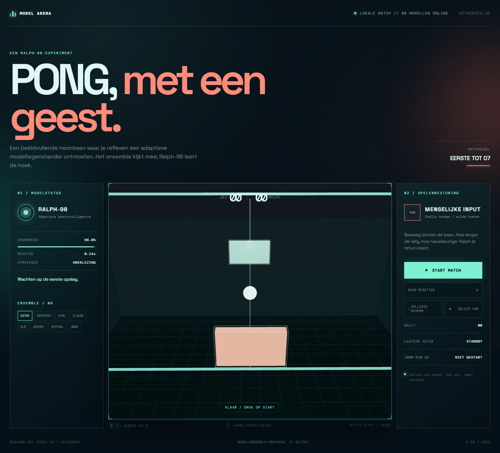
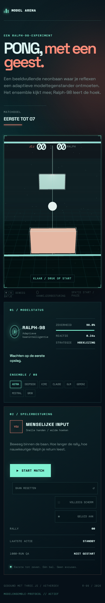
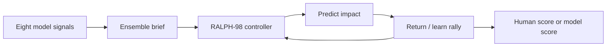

# ◈ MODEL ARENA // 3D PONG

<p align="center">
  <strong>A SMALL COURT. EIGHT SIGNALS. ONE VERY ADAPTIVE OPPONENT.</strong><br />
  <em>Human reflexes versus RALPH-98 — a local-first Three.js experiment orchestrated by the Kathedraal model ensemble.</em>
</p>

<p align="center">
  <a href="https://3d-pong-model-arena.vercel.app"></a>
  
  
</p>

> **Play the live build:** [3d-pong-model-arena.vercel.app](https://3d-pong-model-arena.vercel.app)
> Production deployment verified: Vercel alias is live and serves the Vite build.
> **Source repository:** [github.com/Maca2024/3d-pong-model-arena](https://github.com/Maca2024/3d-pong-model-arena)

<p align="center">
  
</p>

<p align="center"><em>Instrument-panel mode: eight signals online, one court in focus.</em></p>

<p align="center">
  
</p>

```text
                 ┌───────────────────────────────────────┐
                 │  M O D E L   A R E N A   /   0 8      │
                 │                                         │
                 │           ·       ◇       ·             │
                 │        ┌─────────────────┐              │
                 │   YOU  │       ●         │  RALPH-98   │
                 │        └─────────────────┘              │
                 │         ANGLE READ // LIVE              │
                 └───────────────────────────────────────┘
                     REFLEX  ×  PATTERN  ×  ADAPTATION
```

## The idea

MODEL ARENA is deliberately small: one perspective court, one ball, two paddles, first to seven. The opponent is `RALPH-98`, an adaptive local controller that predicts the next impact, learns from rally length and changes its active strategy across the eight-model ensemble.

The game does **not** call an AI provider during play. The model collaboration happens at build time; the released client stays fast, private, deterministic and playable offline after its assets load.

## Eight-model collaboration

The LiteLLM `plan-panel` orchestrated eight bounded contributions into the implementation brief. The merged direction was:

| Signal | Contribution in the game |
|---|---|
| Astra | Arena composition, emissive lighting, readable court hierarchy |
| Claude | Adaptive difficulty, 60 Hz fixed-step physics, pause-on-blur |
| DeepSeek | Lane split and bounce prediction for the opponent |
| Kimi | Rally tempo, reaction windows and safe speed ramp |
| GLM | Counter-play strategy labels and return feedback |
| Gemini | Pattern-aware ensemble rotation and responsive composition |
| Mistral | Velocity handling, ball trail and momentum feel |
| Grok | `data-testid` hooks and browser-verifiable interaction contract |

Full orchestration evidence lives in [`docs/model-collaboration.md`](docs/model-collaboration.md). The Atlas route and bounded `/aetherdev` excerpt are recorded in [`CONTEXT.md`](CONTEXT.md).

## Controls

| Input | Action |
|---|---|
| `W` / `S` or arrow keys | Move your paddle |
| Pointer / touch drag | Move inside the court |
| `Space` | Start, pause or resume |
| `START MATCH` | Begin the rally |
| `RESET COURT` | Return to 00–00 |

First to **07** wins. Paddle contact offset changes the rebound angle. Rally length increases the opponent’s confidence, but a human return can still break the read.

## Ralph-98 loop



The `98%` is a design target and personality marker, not a statistical guarantee. The controller has a hard speed cap, bounded reaction time and no teleporting. The ball physics run at a fixed 60 Hz step while rendering stays independent.

## Visual system

- **Mood:** dark instrument panel / neon laboratory / quiet competitive tension.
- **Palette:** `#061018` ink, `#7ff1d1` model mint, `#ff8c79` human coral, `#ffe29a` signal yellow.
- **Type:** Space Grotesk for the display layer, DM Mono for telemetry.
- **Depth:** Three.js perspective camera, fog, grid floor, emissive rails, ball light, dust field and motion trail.
- **Restraint:** no provider calls, no account flow, no stock art, no hidden gameplay dependency.

## Run it locally

```bash
npm install
npm run dev
```

Open `http://127.0.0.1:5173`.

## Quality gate

```bash
npm run build
npm test
python tests/browser_smoke.py
```

The Ralph-98 release loop checks the production build, static game contract, desktop and mobile rendering, keyboard and pointer input, reset behaviour, screenshots and browser console errors.

## Project map

```text
src/main.js                 Three.js scene + fixed-step game loop
src/style.css               Visual system, responsive layout, reduced motion
tests/game.test.js          Static contract tests
tests/browser_smoke.py      Playwright desktop/mobile smoke test
scripts/request_ensemble.py Reproducible LiteLLM panel request (no secrets)
docs/model-collaboration.md Eight-model orchestration evidence
CONTEXT.md                  Build ledger, Ralph loop and deployment evidence
```

## License / status

Private AetherLink experiment. The game is intentionally compact and open to iteration: tune the court, the model personality and the visual signal language without turning a five-minute match into a framework.
